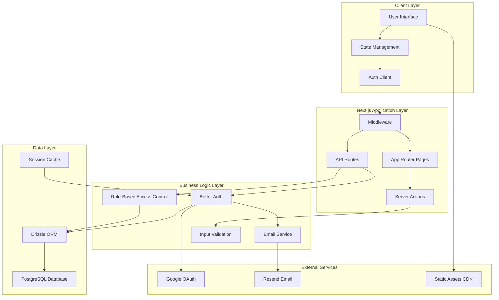
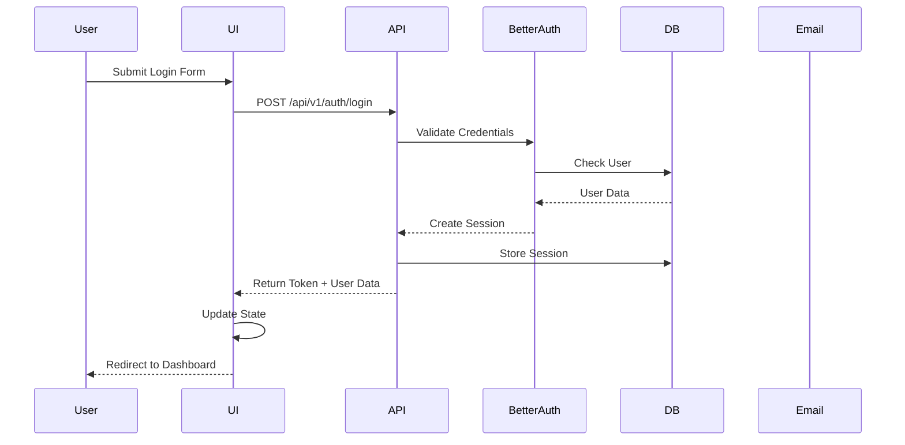
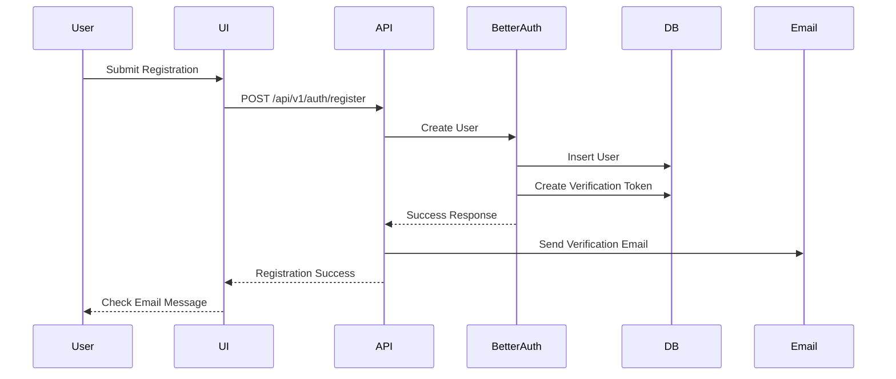
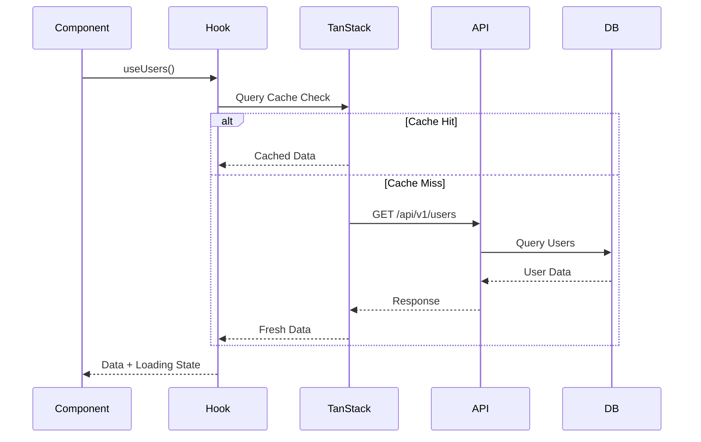
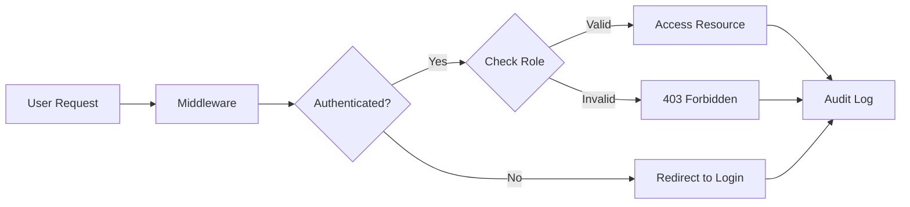
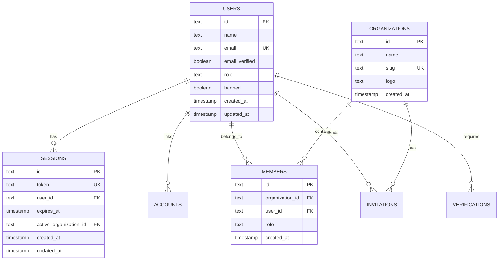

# System Architecture

## Overview

This document outlines the complete system architecture of the NextJS starter template, including technology stack, component relationships, data flow, and deployment architecture.

## Technology Stack

### Frontend Layer

```
┌─────────────────────────────────────────────────────────────┐
│                    Frontend Architecture                     │
├─────────────────────────────────────────────────────────────┤
│ React 18 + Next.js 16 (App Router)                          │
│ ├── Route Groups: (main), (auth), (dashboard), (protected) │
│ ├── Server Components (RSC)                                 │
│ ├── Client Components                                        │
│ └── Middleware (Auth + Security)                            │
├─────────────────────────────────────────────────────────────┤
│ UI Layer                                                     │
│ ├── Tailwind CSS 4 (Styling)                                │
│ ├── Radix UI (Component Primitives)                         │
│ ├── Framer Motion (Animations)                              │
│ └── Lucide React (Icons)                                    │
├─────────────────────────────────────────────────────────────┤
│ State Management                                             │
│ ├── Zustand (Client State)                                  │
│ ├── TanStack Query (Server State)                           │
│ ├── Nuqs (URL State)                                        │
│ └── React Hook Form (Form State)                            │
└─────────────────────────────────────────────────────────────┘
```

### Backend Layer

```
┌─────────────────────────────────────────────────────────────┐
│                    Backend Architecture                      │
├─────────────────────────────────────────────────────────────┤
│ API Routes                                                   │
│ ├── RESTful Endpoints (/api/v1/)                            │
│ ├── Better Auth Integration (/api/auth/[...all])            │
│ ├── Server Actions (use server)                             │
│ └── Middleware (Auth + Security Headers)                    │
├─────────────────────────────────────────────────────────────┤
│ Business Logic                                               │
│ ├── Authentication (Better Auth)                            │
│ ├── Authorization (RBAC)                                     │
│ ├── Email Services (Resend)                                 │
│ ├── File Upload Handling                                    │
│ └── Data Validation (Zod)                                   │
├─────────────────────────────────────────────────────────────┤
│ Data Access Layer                                            │
│ ├── Drizzle ORM (Database Layer)                            │
│ ├── PostgreSQL (Database)                                   │
│ ├── Connection Pooling                                      │
│ └── Database Migrations                                     │
└─────────────────────────────────────────────────────────────┘
```

## High-Level Architecture Diagram



## Component Architecture

### Frontend Component Hierarchy

```
src/app/
├── (main)/                    # Public marketing pages
│   ├── layout.tsx            # Main layout with header/footer
│   ├── page.tsx              # Landing page
│   ├── about/page.tsx        # About page
│   ├── blogs/                # Blog system
│   └── contact/page.tsx      # Contact form
├── (auth)/                   # Authentication pages
│   ├── layout.tsx            # Minimal auth layout
│   ├── auth/login/page.tsx   # Login form
│   ├── auth/register/page.tsx # Registration form
│   └── auth/forgot-password/page.tsx # Password reset
├── (dashboard)/              # Protected dashboard
│   ├── layout.tsx            # Dashboard layout with sidebar
│   ├── dashboard/default/    # Main dashboard
│   ├── dashboard/user/       # User management
│   └── dashboard/kanban/     # Kanban board
└── (protected)/              # User profile area
    ├── layout.tsx            # Protected layout
    └── profile/page.tsx      # User profile
```

### Component Architecture Patterns

#### 1. Atomic Design Principles

```
Atoms (smallest)
├── Button
├── Input
├── Label
└── Icon

Molecules (combined atoms)
├── Form Field
├── Search Box
├── User Avatar
└── Card

Organisms (combined molecules)
├── Header
├── Sidebar
├── Data Table
└── Form

Templates (page layouts)
├── Dashboard Layout
├── Auth Layout
└── Marketing Layout

Pages (specific instances)
├── Login Page
├── Dashboard Page
└── User Management Page
```

#### 2. Feature-Based Architecture

```
src/features/
├── users/
│   ├── components/
│   │   ├── user-form.tsx
│   │   ├── user-table.tsx
│   │   └── cell-action.tsx
│   ├── hooks/
│   │   └── use-users.ts
│   └── types/
│       └── user-types.ts
└── kanban/
    ├── components/
    │   ├── kanban-board.tsx
    │   ├── task-card.tsx
    │   └── board-column.tsx
    └── store/
        └── kanban-store.ts
```

## Data Flow Architecture

### Authentication Flow



### User Registration Flow



### Data Fetching Flow



## Security Architecture

### Security Layers

```
┌─────────────────────────────────────────────────────────────┐
│                    Security Architecture                     │
├─────────────────────────────────────────────────────────────┤
│ Network Security                                            │
│ ├── HTTPS/TLS Encryption                                    │
│ ├── Content Security Policy (CSP)                           │
│ ├── X-Frame-Options: DENY                                  │
│ ├── X-Content-Type-Options: nosniff                        │
│ └── Permissions-Policy                                      │
├─────────────────────────────────────────────────────────────┤
│ Application Security                                        │
│ ├── Authentication (Better Auth + JWT)                      │
│ ├── Authorization (RBAC)                                    │
│ ├── Input Validation (Zod)                                 │
│ ├── Session Management                                     │
│ └── CSRF Protection                                         │
├─────────────────────────────────────────────────────────────┤
│ Data Security                                               │
│ ├── Password Hashing (bcrypt)                               │
│ ├── Database Encryption (SSL)                               │
│ ├── Environment Variables Security                         │
│ └── Audit Logging                                           │
└─────────────────────────────────────────────────────────────┘
```

### Authentication & Authorization Flow



## Database Architecture

### Schema Relationships



### Database Performance Architecture

```
┌─────────────────────────────────────────────────────────────┐
│                 Database Performance Layer                  │
├─────────────────────────────────────────────────────────────┤
│ Connection Pooling                                           │
│ ├── Max Connections: 10                                     │
│ ├── SSL Enabled: Production                                 │
│ ├── Connection Reuse                                        │
│ └── Timeout Management                                      │
├─────────────────────────────────────────────────────────────┤
│ Query Optimization                                           │
│ ├── Indexes on Foreign Keys                                 │
│ ├── Unique Constraints                                      │
│ ├── Efficient JOINs                                        │
│ └── Pagination Strategies                                   │
├─────────────────────────────────────────────────────────────┤
│ Caching Strategy                                             │
│ ├── Session Cache (5-minute)                                │
│ ├── Query Result Caching                                    │
│ ├── Static Asset Caching                                    │
│ └── CDN Integration                                         │
└─────────────────────────────────────────────────────────────┘
```

## Deployment Architecture

### Development Environment

```
┌─────────────────────────────────────────────────────────────┐
│                 Development Architecture                    │
├─────────────────────────────────────────────────────────────┤
│ Local Development                                            │
│ ├── Node.js 18+                                             │
│ ├── PostgreSQL (local/docker)                               │
│ ├── Redis (optional for caching)                            │
│ └── File System Storage                                      │
├─────────────────────────────────────────────────────────────┤
│ Development Tools                                            │
│ ├── Next.js Dev Server                                      │
│ ├── Hot Module Replacement                                  │
│ ├── TypeScript Compilation                                  │
│ └── ESLint + Prettier                                       │
└─────────────────────────────────────────────────────────────┘
```

### Production Architecture

```
┌─────────────────────────────────────────────────────────────┐
│                  Production Architecture                    │
├─────────────────────────────────────────────────────────────┤
│ Container Strategy                                           │
│ ├── Docker Multi-stage Builds                               │
│ ├── Alpine Linux Base Image                                 │
│ ├── Optimized Node.js Runtime                              │
│ └── Health Checks                                           │
├─────────────────────────────────────────────────────────────┤
│ Orchestration                                                │
│ ├── Vercel Platform (Recommended)                           │
│ ├── Docker Swarm Support                                    │
│ ├── Kubernetes Compatibility                                │
│ └── Self-hosted Options                                     │
├─────────────────────────────────────────────────────────────┤
│ Infrastructure                                               │
│ ├── Load Balancer                                           │
│ ├── Auto-scaling                                            │
│ ├── CDN Integration                                         │
│ ├── Managed Database (PostgreSQL)                           │
│ └── Managed Email Service (Resend)                          │
└─────────────────────────────────────────────────────────────┘
```

## Monitoring & Observability

### Logging Architecture

```
┌─────────────────────────────────────────────────────────────┐
│                    Logging Architecture                      │
├─────────────────────────────────────────────────────────────┤
│ Structured Logging                                           │
│ ├── Winston Logger                                          │
│ ├── JSON Log Format                                         │
│ ├── Trace ID Correlation                                    │
│ └── Log Levels (error, warn, info, debug)                  │
├─────────────────────────────────────────────────────────────┤
│ Request Logging                                              │
│ ├── API Request/Response Logging                           │
│ ├── Performance Metrics                                    │
│ ├── Error Tracking                                         │
│ └── User Activity Logs                                     │
├─────────────────────────────────────────────────────────────┤
│ Database Auditing                                            │
│ ├── Audit Log Triggers                                     │
│ ├── Change Tracking                                        │
│ └── User Action Logging                                    │
└─────────────────────────────────────────────────────────────┘
```

## Scalability Considerations

### Horizontal Scaling Strategy

```
┌─────────────────────────────────────────────────────────────┐
│                 Scalability Architecture                     │
├─────────────────────────────────────────────────────────────┤
│ Application Scaling                                          │
│ ├── Stateless Application Design                            │
│ ├── Session Externalization                                 │
│ ├── Database Connection Pooling                             │
│ └── Load Balancer Support                                   │
├─────────────────────────────────────────────────────────────┤
│ Database Scaling                                             │
│ ├── Read Replicas Support                                   │
│ ├── Connection Pooling                                      │
│ ├── Query Optimization                                      │
│ └── Indexing Strategy                                       │
├─────────────────────────────────────────────────────────────┤
│ Caching Strategy                                             │
│ ├── Application-level Caching                               │
│ ├── Database Query Caching                                  │
│ ├── Static Asset Caching                                    │
│ └── CDN Distribution                                        │
└─────────────────────────────────────────────────────────────┘
```

## Technology Rationale

### Why Next.js 16 with App Router?

- **Server Components**: Improved performance and SEO
- **Streaming**: Faster initial page loads
- **Nested Layouts**: Complex UI patterns
- **Built-in Optimizations**: Image, font, and script optimization

### Why Better Auth?

- **Type Safety**: Full TypeScript support
- **Flexibility**: Customizable authentication flows
- **Security**: Built-in security best practices
- **Multi-tenant**: Organization support out of the box

### Why Drizzle ORM?

- **Type Safety**: Compile-time type checking
- **Performance**: Lightweight and fast
- **SQL-like Syntax**: Easy to learn and use
- **Migration System**: Automated schema management

### Why PostgreSQL?

- **ACID Compliance**: Reliable transaction handling
- **JSON Support**: Flexible data storage
- **Performance**: Optimized for complex queries
- **Scalability**: Proven at scale

---

**Document Version**: 1.0
**Last Updated**: October 31, 2025
**Architecture Review**: January 31, 2026
