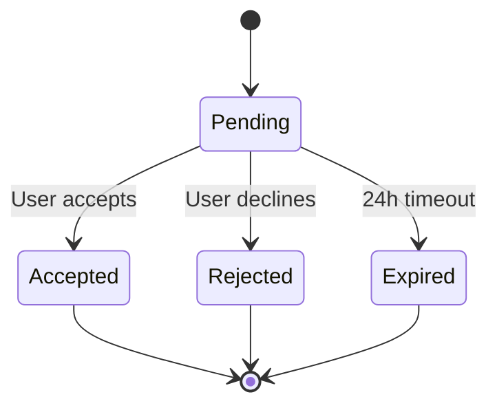
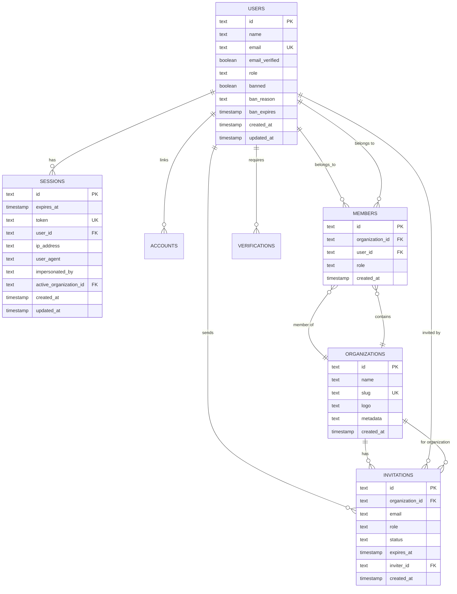

# Database Schema Documentation

## Overview

This document provides comprehensive documentation for the database schema used in the NextJS starter template, including table structures, relationships, constraints, and data flow.

## Database Architecture

### Technology Stack

- **Database**: PostgreSQL 15+
- **ORM**: Drizzle ORM 0.44+
- **Migration Tool**: Drizzle Kit
- **Connection Pooling**: Built-in PostgreSQL pool

### Design Principles

- **Type Safety**: Full TypeScript integration
- **Performance**: Optimized queries and indexing
- **Security**: Role-based access and audit logging
- **Scalability**: Multi-tenant architecture support
- **Maintainability**: Clear naming conventions and relationships

## Core Tables

### 1. Users Table (`users`)

Stores user account information and authentication data.

```sql
CREATE TABLE users (
    id TEXT PRIMARY KEY,
    name TEXT NOT NULL,
    email TEXT UNIQUE NOT NULL,
    email_verified BOOLEAN DEFAULT false,
    image TEXT,
    role TEXT NOT NULL DEFAULT 'USER',
    banned BOOLEAN DEFAULT false,
    ban_reason TEXT,
    ban_expires TIMESTAMP,
    created_at TIMESTAMP DEFAULT CURRENT_TIMESTAMP,
    updated_at TIMESTAMP DEFAULT CURRENT_TIMESTAMP
);
```

#### Column Details

```typescript
interface User {
  id: string; // Primary key, UUID format
  name: string; // User's full name (2-100 chars)
  email: string; // Unique email address
  emailVerified: boolean; // Email verification status
  image?: string; // Profile image URL
  role: UserRole; // SUPERADMIN | ADMIN | USER
  banned: boolean; // Account ban status
  banReason?: string; // Reason for ban
  banExpires?: Date; // Ban expiration date
  createdAt: Date; // Account creation timestamp
  updatedAt: Date; // Last update timestamp
}
```

#### Enum Types

```typescript
enum UserRole {
  SUPERADMIN = "superadmin",
  ADMIN = "admin",
  USER = "user",
}
```

#### Constraints

- `id`: Primary key, required
- `name`: Not null, max 100 characters
- `email`: Unique, not null, valid email format
- `role`: Not null, default 'USER'
- `created_at`: Default current timestamp
- `updated_at`: Auto-update on changes

#### Indexes

```sql
CREATE UNIQUE INDEX users_email_idx ON users(email);
CREATE INDEX users_role_idx ON users(role);
CREATE INDEX users_banned_idx ON users(banned);
CREATE INDEX users_created_at_idx ON users(created_at);
```

### 2. Sessions Table (`sessions`)

Manages user authentication sessions and tokens.

```sql
CREATE TABLE sessions (
    id TEXT PRIMARY KEY,
    expires_at TIMESTAMP NOT NULL,
    token TEXT UNIQUE NOT NULL,
    user_id TEXT NOT NULL,
    ip_address TEXT,
    user_agent TEXT,
    impersonated_by TEXT,
    active_organization_id TEXT,
    created_at TIMESTAMP DEFAULT CURRENT_TIMESTAMP,
    updated_at TIMESTAMP DEFAULT CURRENT_TIMESTAMP,
    FOREIGN KEY (user_id) REFERENCES users(id) ON DELETE CASCADE,
    FOREIGN KEY (active_organization_id) REFERENCES organizations(id) ON DELETE SET NULL
);
```

#### Column Details

```typescript
interface Session {
  id: string; // Primary key
  expiresAt: Date; // Session expiration
  token: string; // Unique session token
  userId: string; // Foreign key to users
  ipAddress?: string; // User's IP address
  userAgent?: string; // Browser user agent
  impersonatedBy?: string; // Admin impersonation tracking
  activeOrganizationId?: string; // Current organization context
  createdAt: Date; // Session creation
  updatedAt: Date; // Last activity update
}
```

#### Session Configuration

- **Default Expiration**: 72 hours (3 days)
- **Refresh Window**: 24 hours before expiration
- **Cookie Security**: HTTP-only, secure in production
- **Concurrent Sessions**: Multiple sessions per user allowed

#### Indexes

```sql
CREATE UNIQUE INDEX sessions_token_idx ON sessions(token);
CREATE INDEX sessions_user_id_idx ON sessions(user_id);
CREATE INDEX sessions_expires_at_idx ON sessions(expires_at);
CREATE INDEX sessions_active_organization_id_idx ON sessions(active_organization_id);
```

### 3. Accounts Table (`accounts`)

Links users to external authentication providers (OAuth).

```sql
CREATE TABLE accounts (
    id TEXT PRIMARY KEY,
    account_id TEXT NOT NULL,
    provider_id TEXT NOT NULL,
    user_id TEXT NOT NULL,
    access_token TEXT,
    refresh_token TEXT,
    id_token TEXT,
    access_token_expires_at TIMESTAMP,
    refresh_token_expires_at TIMESTAMP,
    scope TEXT,
    password TEXT,
    created_at TIMESTAMP DEFAULT CURRENT_TIMESTAMP,
    updated_at TIMESTAMP DEFAULT CURRENT_TIMESTAMP,
    FOREIGN KEY (user_id) REFERENCES users(id) ON DELETE CASCADE
);
```

#### Column Details

```typescript
interface Account {
  id: string; // Primary key
  accountId: string; // Provider account ID
  providerId: string; // OAuth provider (google, github, etc.)
  userId: string; // Foreign key to users
  accessToken?: string; // OAuth access token
  refreshToken?: string; // OAuth refresh token
  idToken?: string; // JWT ID token
  accessTokenExpiresAt?: Date; // Token expiration
  refreshTokenExpiresAt?: Date; // Refresh token expiration
  scope?: string; // OAuth scope
  password?: string; // Hashed password for email auth
  createdAt: Date; // Account linking timestamp
  updatedAt: Date; // Last update
}
```

#### Provider Types

```typescript
enum ProviderType {
  GOOGLE = "google",
  GITHUB = "github",
  EMAIL = "email",
  CREDENTIALS = "credentials",
}
```

#### Indexes

```sql
CREATE UNIQUE INDEX accounts_provider_unique_idx ON accounts(provider_id, account_id);
CREATE INDEX accounts_user_id_idx ON accounts(user_id);
CREATE INDEX accounts_provider_id_idx ON accounts(provider_id);
```

### 4. Organizations Table (`organizations`)

Supports multi-tenant architecture with organization-based data isolation.

```sql
CREATE TABLE organizations (
    id TEXT PRIMARY KEY,
    name TEXT NOT NULL,
    slug TEXT UNIQUE NOT NULL,
    logo TEXT,
    metadata TEXT,
    created_at TIMESTAMP NOT NULL
);
```

#### Column Details

```typescript
interface Organization {
  id: string; // Primary key
  name: string; // Organization display name
  slug: string; // URL-friendly identifier
  logo?: string; // Organization logo URL
  metadata?: string; // JSON metadata
  createdAt: Date; // Organization creation date
}
```

#### Constraints

- `slug`: Unique, alphanumeric + hyphens, lowercase
- `name`: Required, 2-100 characters
- `created_at`: Required timestamp

#### Indexes

```sql
CREATE UNIQUE INDEX organizations_slug_idx ON organizations(slug);
CREATE INDEX organizations_name_idx ON organizations(name);
CREATE INDEX organizations_created_at_idx ON organizations(created_at);
```

### 5. Members Table (`members`)

Manages organization membership and role assignments.

```sql
CREATE TABLE members (
    id TEXT PRIMARY KEY,
    organization_id TEXT NOT NULL,
    user_id TEXT NOT NULL,
    role TEXT NOT NULL DEFAULT 'MEMBER',
    created_at TIMESTAMP NOT NULL,
    FOREIGN KEY (organization_id) REFERENCES organizations(id) ON DELETE CASCADE,
    FOREIGN KEY (user_id) REFERENCES users(id) ON DELETE CASCADE
);
```

#### Column Details

```typescript
interface Member {
  id: string; // Primary key
  organizationId: string; // Foreign key to organizations
  userId: string; // Foreign key to users
  role: OrganizationRole; // OWNER | MEMBER
  createdAt: Date; // Membership start date
}
```

#### Organization Roles

```typescript
enum OrganizationRole {
  OWNER = "owner",
  MEMBER = "member",
}
```

#### Role Permissions

```typescript
interface RolePermissions {
  OWNER: {
    canManageOrganization: true;
    canManageMembers: true;
    canManageSettings: true;
    canDeleteOrganization: true;
  };
  MEMBER: {
    canManageOrganization: false;
    canManageMembers: false;
    canManageSettings: false;
    canDeleteOrganization: false;
  };
}
```

#### Constraints

- `organization_id` + `user_id`: Unique combination
- `role`: Default 'MEMBER'
- `created_at`: Required timestamp

#### Indexes

```sql
CREATE UNIQUE INDEX members_org_user_idx ON members(organization_id, user_id);
CREATE INDEX members_organization_id_idx ON members(organization_id);
CREATE INDEX members_user_id_idx ON members(user_id);
CREATE INDEX members_role_idx ON members(role);
```

### 6. Invitations Table (`invitations`)

Manages organization invitation system with expiration and tracking.

```sql
CREATE TABLE invitations (
    id TEXT PRIMARY KEY,
    organization_id TEXT NOT NULL,
    email TEXT NOT NULL,
    role TEXT,
    status TEXT DEFAULT 'pending',
    expires_at TIMESTAMP NOT NULL,
    inviter_id TEXT NOT NULL,
    created_at TIMESTAMP DEFAULT CURRENT_TIMESTAMP,
    FOREIGN KEY (organization_id) REFERENCES organizations(id) ON DELETE CASCADE,
    FOREIGN KEY (inviter_id) REFERENCES users(id) ON DELETE CASCADE
);
```

#### Column Details

```typescript
interface Invitation {
  id: string; // Primary key
  organizationId: string; // Foreign key to organizations
  email: string; // Invitee email address
  role?: OrganizationRole; // Role for invited user
  status: InvitationStatus; // pending | accepted | rejected | expired
  expiresAt: Date; // Invitation expiration
  inviterId: string; // Who sent the invitation
  createdAt: Date; // Invitation creation date
}
```

#### Invitation Status

```typescript
enum InvitationStatus {
  PENDING = "pending",
  ACCEPTED = "accepted",
  REJECTED = "rejected",
  EXPIRED = "expired",
}
```

#### Invitation Lifecycle



#### Constraints

- `expires_at`: Required, typically 24-48 hours from creation
- `status`: Default 'pending'
- `email`: Must be valid email format

#### Indexes

```sql
CREATE INDEX invitations_organization_id_idx ON invitations(organization_id);
CREATE INDEX invitations_email_idx ON invitations(email);
CREATE INDEX invitations_status_idx ON invitations(status);
CREATE INDEX invitations_expires_at_idx ON invitations(expires_at);
CREATE INDEX invitations_inviter_id_idx ON invitations(inviter_id);
```

### 7. Verifications Table (`verifications`)

Stores email verification and password reset tokens.

```sql
CREATE TABLE verifications (
    id TEXT PRIMARY KEY,
    identifier TEXT NOT NULL,
    value TEXT NOT NULL,
    expires_at TIMESTAMP NOT NULL,
    created_at TIMESTAMP DEFAULT CURRENT_TIMESTAMP,
    updated_at TIMESTAMP DEFAULT CURRENT_TIMESTAMP
);
```

#### Column Details

```typescript
interface Verification {
  id: string; // Primary key
  identifier: string; // Email address or user identifier
  value: string; // Verification token or code
  expiresAt: Date; // Token expiration
  createdAt: Date; // Token creation
  updatedAt: Date; // Last update
}
```

#### Token Types

- **Email Verification**: 24-hour expiration
- **Password Reset**: 1-hour expiration
- **Account Recovery**: 24-hour expiration

#### Constraints

- `identifier`: Required (typically email)
- `value`: Required, cryptographically secure random string
- `expires_at`: Required timestamp

#### Indexes

```sql
CREATE INDEX verifications_identifier_idx ON verifications(identifier);
CREATE INDEX verifications_value_idx ON verifications(value);
CREATE INDEX verifications_expires_at_idx ON verifications(expires_at);
```

### 8. JWT Keys Table (`jwkss`)

Stores JSON Web Key (JWK) for JWT token signing and verification.

```sql
CREATE TABLE jwkss (
    id TEXT PRIMARY KEY,
    public_key TEXT NOT NULL,
    private_key TEXT NOT NULL,
    created_at TIMESTAMP NOT NULL
);
```

#### Column Details

```typescript
interface JWK {
  id: string; // Primary key
  publicKey: string; // PEM-encoded public key
  privateKey: string; // PEM-encoded private key
  createdAt: Date; // Key creation timestamp
}
```

#### Key Management

- **Algorithm**: RS256 (RSA Signature with SHA-256)
- **Key Rotation**: Manual or automated rotation support
- **Security**: Private key encryption at rest

### 9. Audit Logs Table (`audit_logs`)

Tracks all database changes for security and compliance.

```sql
CREATE TABLE audit_logs (
    id SERIAL PRIMARY KEY,
    table_name TEXT NOT NULL,
    operation TEXT NOT NULL,
    changed_at TIMESTAMP DEFAULT CURRENT_TIMESTAMP,
    user_id TEXT,
    changed_data TEXT
);
```

#### Column Details

```typescript
interface AuditLog {
  id: number; // Auto-incrementing primary key
  tableName: string; // Name of the modified table
  operation: string; // INSERT | UPDATE | DELETE
  changedAt: Date; // Change timestamp
  userId?: string; // User who made the change
  changedData?: string; // JSON representation of changes
}
```

#### Audit Triggers

```sql
-- Example trigger for users table
CREATE OR REPLACE FUNCTION audit_user_changes()
RETURNS TRIGGER AS $$
BEGIN
    INSERT INTO audit_logs (table_name, operation, user_id, changed_data)
    VALUES (
        'users',
        TG_OP,
        current_setting('app.current_user_id', true),
        row_to_json(NEW)
    );
    RETURN NEW;
END;
$$ LANGUAGE plpgsql;

CREATE TRIGGER users_audit_trigger
    AFTER INSERT OR UPDATE OR DELETE ON users
    FOR EACH ROW EXECUTE FUNCTION audit_user_changes();
```

#### Audit Data Format

```json
{
  "table": "users",
  "operation": "UPDATE",
  "userId": "user_123",
  "timestamp": "2025-01-01T12:00:00.000Z",
  "changes": {
    "before": {
      "name": "John Doe",
      "email": "john@example.com"
    },
    "after": {
      "name": "John Updated",
      "email": "john@example.com"
    }
  },
  "ipAddress": "192.168.1.1",
  "userAgent": "Mozilla/5.0..."
}
```

## Database Relationships

### Entity Relationship Diagram (ERD)



### Relationship Types

#### One-to-Many Relationships

- **Users → Sessions**: One user can have multiple sessions
- **Users → Accounts**: One user can have multiple OAuth accounts
- **Organizations → Members**: One organization can have multiple members
- **Organizations → Invitations**: One organization can send multiple invitations

#### Many-to-Many Relationships

- **Users ↔ Organizations**: Through the `members` table
- **Users ↔ Organizations**: Through the `invitations` table (pending)

#### Foreign Key Constraints

```sql
-- Cascading deletes for data consistency
ALTER TABLE sessions DROP CONSTRAINT sessions_user_id_fkey;
ALTER TABLE sessions ADD CONSTRAINT sessions_user_id_fkey
    FOREIGN KEY (user_id) REFERENCES users(id) ON DELETE CASCADE;

-- Set null for organization context
ALTER TABLE sessions ADD CONSTRAINT sessions_active_organization_id_fkey
    FOREIGN KEY (active_organization_id) REFERENCES organizations(id) ON DELETE SET NULL;
```

## Data Types and Constraints

### PostgreSQL Data Types Used

```sql
-- Text types
TEXT                    -- Variable-length string
TEXT UNIQUE             -- Unique constraint
TEXT NOT NULL           -- Non-null constraint

-- Boolean types
BOOLEAN                 -- True/false values
BOOLEAN DEFAULT false    -- Default value

-- Timestamp types
TIMESTAMP               -- Date and time
TIMESTAMP DEFAULT CURRENT_TIMESTAMP  -- Auto timestamp
TIMESTAMP NOT NULL      -- Required timestamp

-- Numeric types
SERIAL                  -- Auto-incrementing integer

-- JSON types (future use)
JSONB                   -- Binary JSON data
```

### Custom Enum Types

```sql
-- User roles
CREATE TYPE user_role AS ENUM ('superadmin', 'admin', 'user');

-- Organization roles
CREATE TYPE organization_role AS ENUM ('owner', 'member');

-- Invitation status
CREATE TYPE invitation_status AS ENUM ('pending', 'accepted', 'rejected', 'expired');
```

### Constraints Summary

```sql
-- Primary keys
PRIMARY KEY (id)         -- Unique identifier for each record

-- Unique constraints
UNIQUE (email)           -- Email uniqueness
UNIQUE (slug)            -- Organization slug uniqueness
UNIQUE (token)           -- Session token uniqueness

-- Foreign key constraints
FOREIGN KEY (user_id) REFERENCES users(id) ON DELETE CASCADE

-- Check constraints (future)
CHECK (age >= 18)        -- Age validation
CHECK (email ~* '^[A-Za-z0-9._%+-]+@[A-Za-z0-9.-]+\.[A-Za-z]{2,}$')  -- Email format
```

## Indexing Strategy

### Primary Indexes

```sql
-- Automatically created with PRIMARY KEY
CREATE INDEX users_pkey ON users(id);
CREATE INDEX organizations_pkey ON organizations(id);
CREATE INDEX sessions_pkey ON sessions(id);
```

### Unique Indexes

```sql
-- Email uniqueness
CREATE UNIQUE INDEX users_email_idx ON users(email);

-- Organization slug uniqueness
CREATE UNIQUE INDEX organizations_slug_idx ON organizations(slug);

-- Session token uniqueness
CREATE UNIQUE INDEX sessions_token_idx ON sessions(token);
```

### Performance Indexes

```sql
-- User lookup by role
CREATE INDEX users_role_idx ON users(role);

-- Session expiration cleanup
CREATE INDEX sessions_expires_at_idx ON sessions(expires_at);

-- Organization member lookup
CREATE INDEX members_organization_id_idx ON members(organization_id);
CREATE INDEX members_user_id_idx ON members(user_id);

-- Invitation management
CREATE INDEX invitations_status_idx ON invitations(status);
CREATE INDEX invitations_expires_at_idx ON invitations(expires_at);
```

### Composite Indexes

```sql
-- User organization membership
CREATE UNIQUE INDEX members_org_user_idx ON members(organization_id, user_id);

-- Account provider lookup
CREATE INDEX accounts_provider_unique_idx ON accounts(provider_id, account_id);
```

### Index Usage Analysis

```sql
-- Check index usage
SELECT
    schemaname,
    tablename,
    indexname,
    idx_scan,
    idx_tup_read,
    idx_tup_fetch
FROM pg_stat_user_indexes
ORDER BY idx_scan DESC;

-- Analyze query performance
EXPLAIN ANALYZE SELECT * FROM users WHERE email = 'test@example.com';
```

## Migration Management

### Migration Files Structure

```
drizzle/
├── 0000_pink_swordsman.sql
├── 0001_mighty_rocket_racer.sql
├── 0002_...
└── meta/
    ├── _journal.json
    ├── 0000_snapshot.json
    ├── 0001_snapshot.json
    └── ...
```

### Migration Commands

```bash
# Generate new migration
npm run db:generate

# Apply migrations
npm run db:migrate

# Check migration status
npm run db:status

# Rollback migration
npm run db:rollback

# Drop and recreate database (dev only)
npm run db:reset
```

### Migration Example

```sql
-- Migration: 0001_add_organizations.sql
CREATE TABLE organizations (
    id TEXT PRIMARY KEY,
    name TEXT NOT NULL,
    slug TEXT UNIQUE NOT NULL,
    logo TEXT,
    metadata TEXT,
    created_at TIMESTAMP NOT NULL
);

-- Create indexes
CREATE INDEX organizations_slug_idx ON organizations(slug);
CREATE INDEX organizations_created_at_idx ON organizations(created_at);

-- Create enum type
CREATE TYPE organization_role AS ENUM ('owner', 'member');
```

## Security Considerations

### Data Protection

```sql
-- Column-level security (future enhancement)
CREATE ROLE read_only;
GRANT SELECT ON users TO read_only;

-- Row-level security (future enhancement)
ALTER TABLE organizations ENABLE ROW LEVEL SECURITY;
CREATE POLICY organization_policy ON organizations
    FOR ALL TO authenticated_users
    USING (id IN (
        SELECT organization_id FROM members
        WHERE user_id = current_user_id()
    ));
```

### Sensitive Data Handling

- **Passwords**: Hashed using bcrypt, never stored in plain text
- **Tokens**: Encrypted at rest, rotated regularly
- **Emails**: Used only for authentication and notifications
- **PII**: Minimal personal information collected

### Audit Trail

```sql
-- Audit log configuration
CREATE EXTENSION IF NOT EXISTS "pg_audit";

-- Track all DDL operations
ALTER SYSTEM SET pgaudit.log = 'ddl';

-- Track specific tables
ALTER SYSTEM SET pgaudit.log_relation = 'users,sessions,organizations';
```

## Performance Optimization

### Query Optimization

```sql
-- Efficient user lookup with email
EXPLAIN (ANALYZE, BUFFERS)
SELECT id, name, email, role
FROM users
WHERE email = 'user@example.com';

-- Organization member count optimization
CREATE INDEX members_org_role_idx ON members(organization_id, role);

-- Session cleanup optimization
DELETE FROM sessions
WHERE expires_at < NOW()
RETURNING id;
```

### Connection Pooling

```typescript
// Database connection configuration
const client = postgres(process.env.DATABASE_URL, {
  max: 10, // Maximum connections
  idle_timeout: 20, // Idle timeout
  connect_timeout: 10, // Connection timeout
  ssl: process.env.DB_SSL === "true" ? "require" : false,
  prepare: false, // Disable prepared statements for PostgreSQL
});
```

### Caching Strategy

```typescript
// Session caching for performance
const sessionCache = new Map<string, Session>();

// Cache invalidation
sessionCache.delete(sessionId);

// Cache TTL management
setTimeout(
  () => {
    sessionCache.delete(sessionId);
  },
  5 * 60 * 1000,
); // 5 minutes
```

## Backup and Recovery

### Backup Strategy

```bash
# Full database backup
pg_dump -h localhost -U postgres -d nextjs_starter \
  --format=custom --compress=9 \
  --file=backup_$(date +%Y%m%d_%H%M%S).dump

# Schema-only backup
pg_dump -h localhost -U postgres -d nextjs_starter \
  --schema-only \
  --file=schema_$(date +%Y%m%d).sql

# Data-only backup
pg_dump -h localhost -U postgres -d nextjs_starter \
  --data-only \
  --file=data_$(date +%Y%m%d).sql
```

### Recovery Procedures

```bash
# Restore from backup
pg_restore -h localhost -U postgres -d nextjs_starter \
  --clean --if-exists \
  backup_20250101_120000.dump

# Point-in-time recovery (WAL archiving required)
pg_basebackup -h localhost -D /backup/base_backup -U postgres -v -P
```

### Disaster Recovery

```sql
-- Create read replica for high availability
CREATE DATABASE nextjs_starter_replica
TEMPLATE nextjs_starter;

-- Logical replication setup
CREATE PUBLICATION nextjs_pub FOR ALL TABLES;
CREATE SUBSCRIPTION nextjs_sub
CONNECTION 'host=replica dbname=nextjs_starter'
PUBLICATION nextjs_pub;
```

---

**Document Version**: 1.0
**Last Updated**: October 31, 2025
**Next Review**: January 31, 2026
