# Application User Flows

## Overview

This document outlines the complete user flows within the NextJS starter application with Better Auth v1.4+ and Drizzle ORM v0.45+, including dashboard navigation, user management, data operations, and feature interactions.

## Application Flow Summary

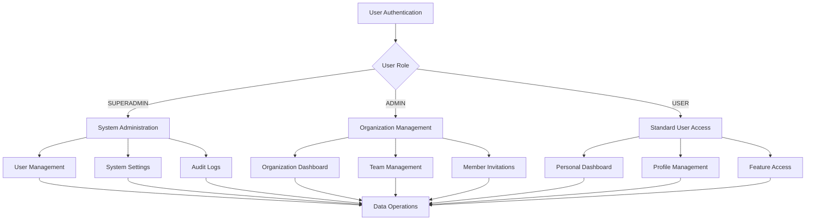

## 1. Dashboard Navigation Flow

### Dashboard Navigation Structure

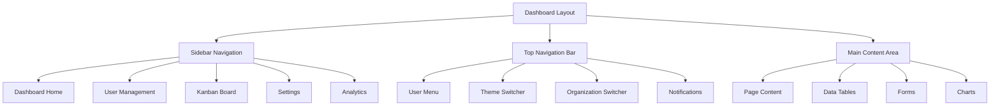

### Navigation Permission Flow

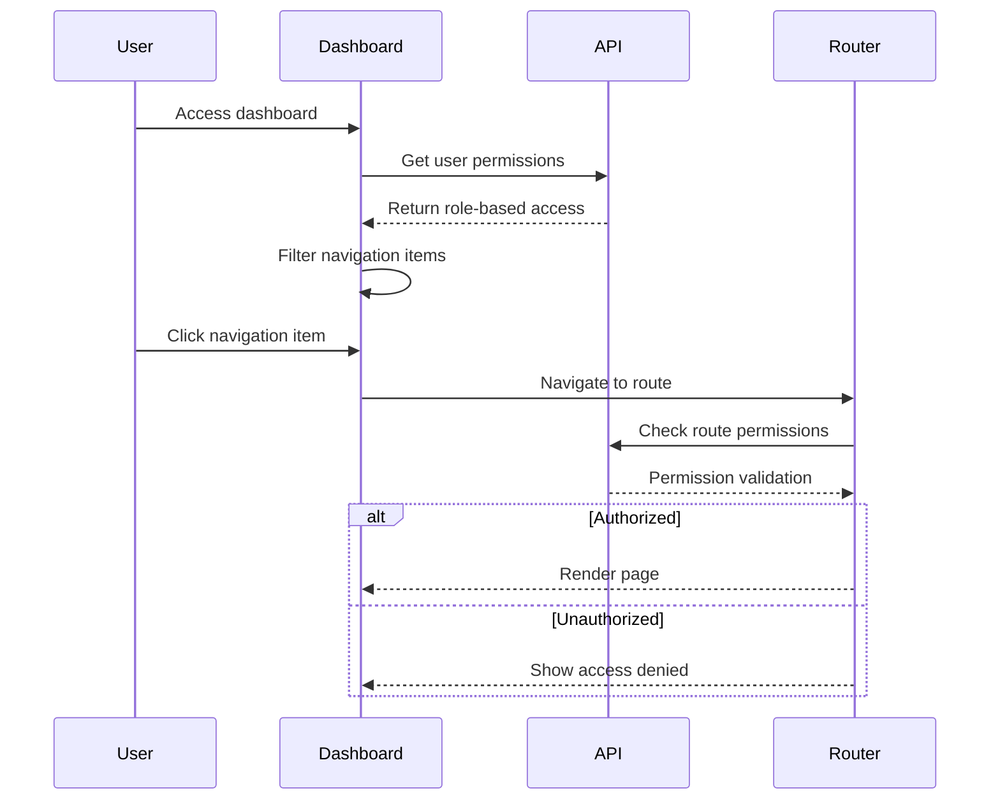

### Role-Based Navigation

```typescript
interface NavigationItems {
  // All users
  common: [
    { label: "Dashboard"; href: "/dashboard"; icon: "LayoutDashboard" },
    { label: "Profile"; href: "/profile"; icon: "User" },
  ];

  // Admin and Superadmin
  admin: [
    { label: "User Management"; href: "/dashboard/users"; icon: "Users" },
    { label: "Analytics"; href: "/dashboard/analytics"; icon: "BarChart" },
    { label: "Settings"; href: "/dashboard/settings"; icon: "Settings" },
  ];

  // Superadmin only
  superadmin: [
    { label: "System Administration"; href: "/admin/system"; icon: "Shield" },
    { label: "Audit Logs"; href: "/admin/audit"; icon: "FileText" },
  ];
}
```

## 2. User Management Flow

### User Management Interface

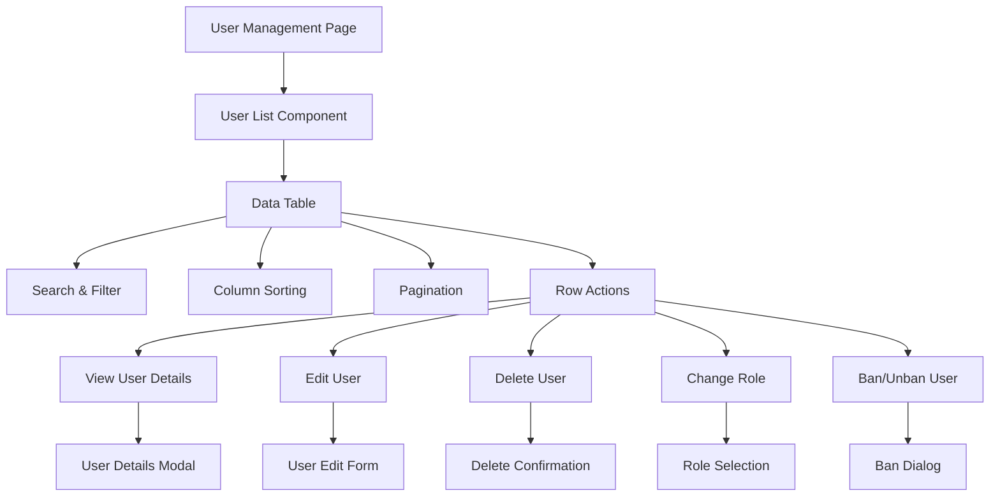

### User List Data Flow

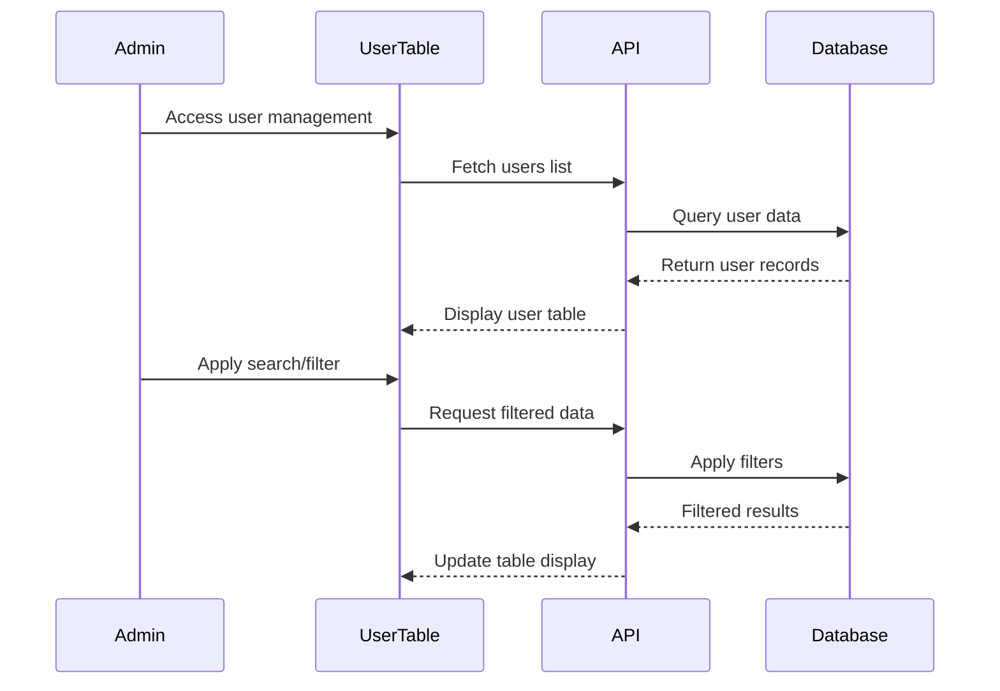

### User CRUD Operations

#### Create User Flow

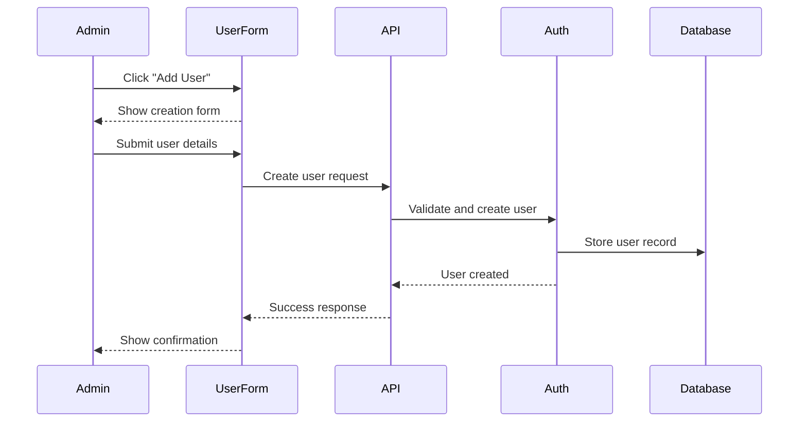

#### Edit User Flow

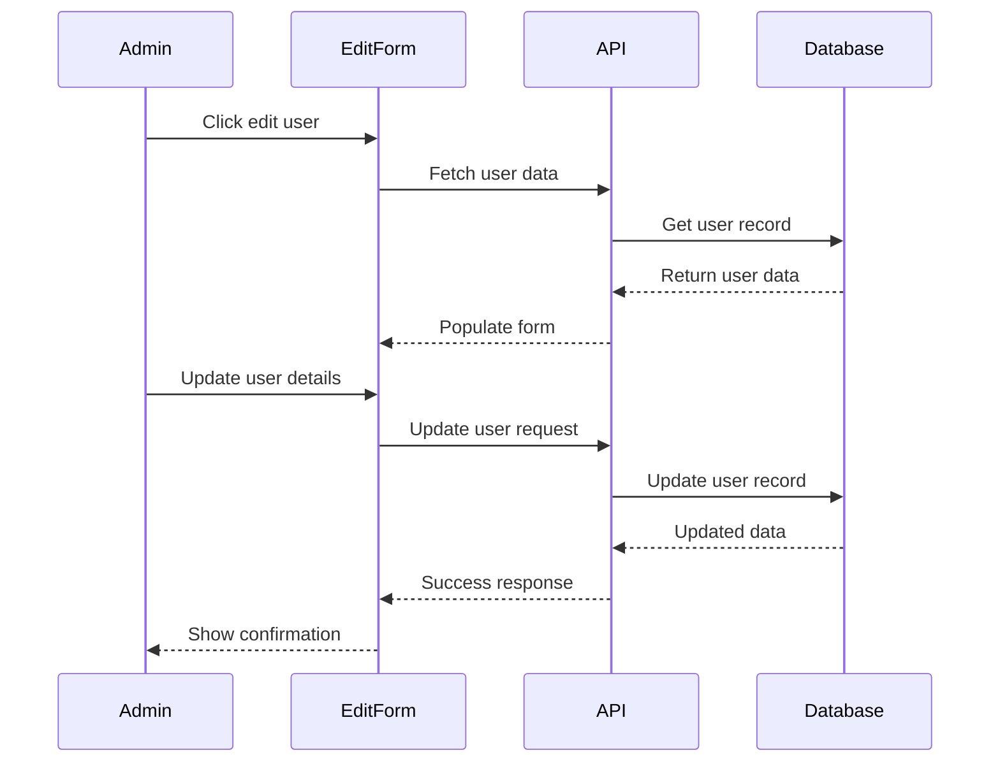

#### Delete User Flow

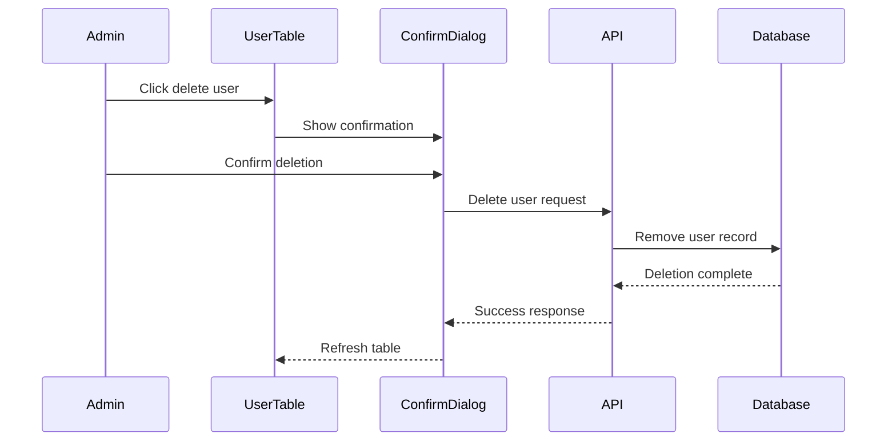

## 3. Data Table Interaction Flow

### Data Table Component Structure

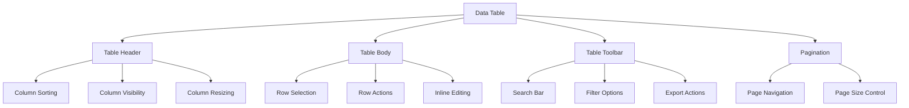

### Data Table Interaction Flow

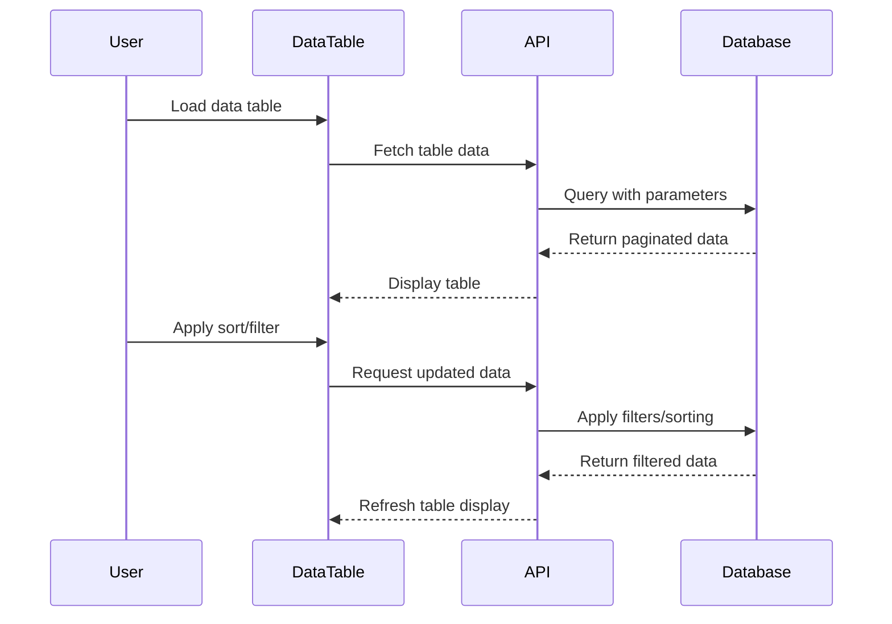

### Data Export Flow

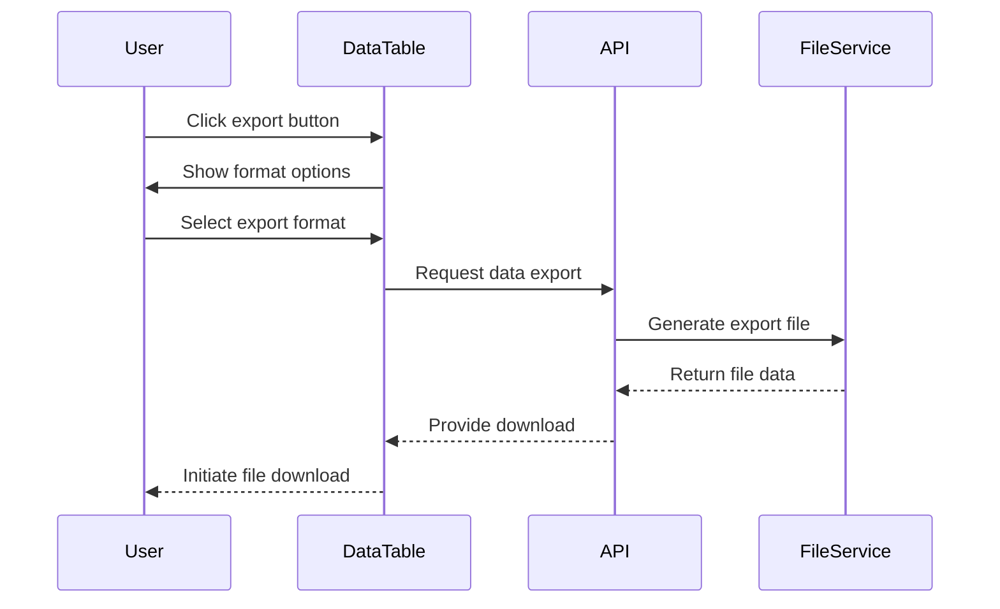

## 4. Kanban Board Flow

### Kanban Board Layout

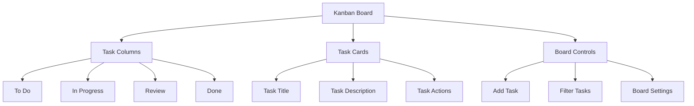

### Task Drag and Drop Flow

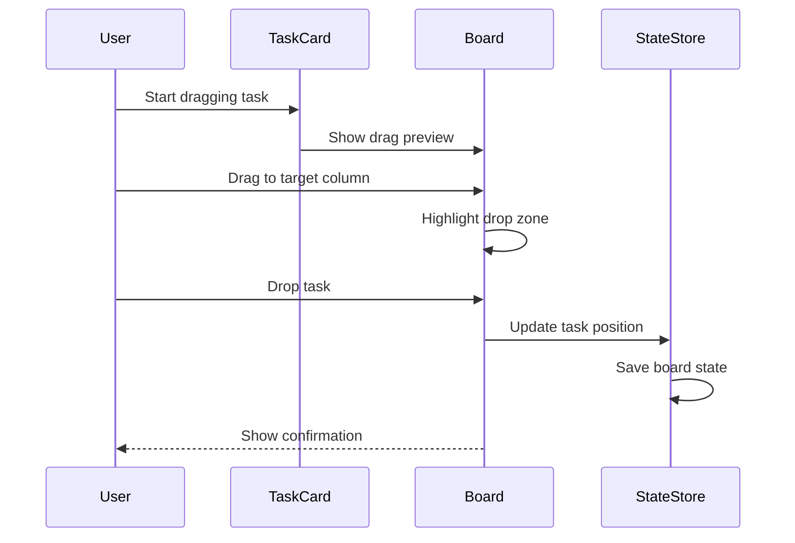

### Task Management Operations

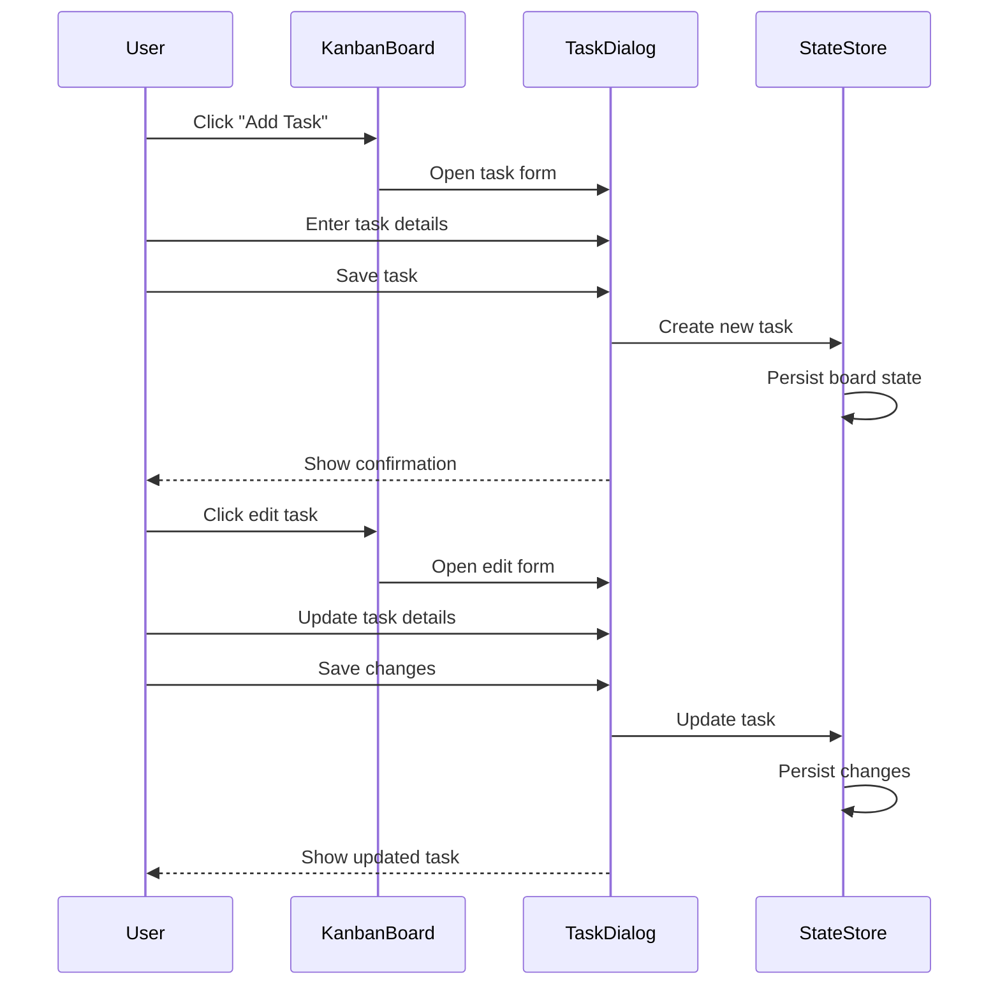

## 5. Profile Management Flow

### User Profile Settings

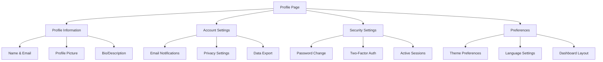

### Profile Update Flow

```mermaid
sequenceDiagram
    participant User
    participant ProfilePage
    participant ProfileForm
    participant API
    participant DB
    participant FileService

    User->>ProfilePage: Navigate to profile
    ProfilePage->>API: GET /api/v1/users/me
    API->>DB: Fetch user profile
    DB-->>API: User profile data
    API-->>ProfilePage: Profile information
    ProfilePage-->>User: Display profile form

    Note over User,FileService: Profile Picture Update
    User->>ProfileForm: Upload new profile picture
    ProfileForm->>FileService: Upload image file
    FileService--->ProfileForm: Return image URL
    ProfileForm->>ProfileForm: Update form with new image

    Note over User,DB: Profile Information Update
    User->>ProfileForm: Update profile information
    User->>ProfileForm: Save changes
    ProfileForm->>API: PUT /api/v1/users/me
    API->>DB: Update user profile
    DB-->>API: Updated profile data
    API-->>ProfileForm: Success response
    ProfileForm--->User: Show success message
    ProfileForm->>ProfilePage: Update displayed profile
```

### Password Change Flow

```mermaid
sequenceDiagram
    participant User
    participant ProfilePage
    participant PasswordForm
    participant API
    participant BetterAuth
    participant DB

    User->>ProfilePage: Navigate to security settings
    ProfilePage--->User: Display password change form
    User->>PasswordForm: Enter current password
    User->>PasswordForm: Enter new password
    User->>PasswordForm: Confirm new password
    User->>PasswordForm: Submit form
    PasswordForm->>API: POST /api/v1/auth/change-password
    API->>BetterAuth: Validate current password
    BetterAuth->>DB: Verify credentials
    DB-->>BetterAuth: Password validation result
    alt Current Password Valid
        BetterAuth->>DB: Update password
        BetterAuth->>DB: Invalidate all sessions
        BetterAuth-->>API: Password updated successfully
        API-->>PasswordForm: Success response
        PasswordForm--->User: Success message + redirect to login
    else Current Password Invalid
        BetterAuth-->>API: Invalid current password
        API-->>PasswordForm: Error response
        PasswordForm--->User: Error message
    end
```

## 6. Organization Management Flow

### Organization Dashboard

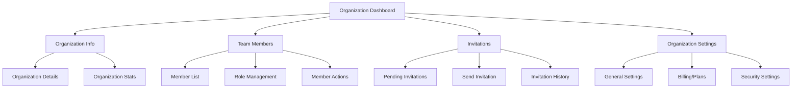

### Team Invitation Flow

```mermaid
sequenceDiagram
    participant Owner
    participant OrgDashboard
    participant InviteForm
    participant API
    participant DB
    participant EmailService
    participant Invitee

    Owner->>OrgDashboard: Navigate to team management
    OrgDashboard->>InviteForm: Open invitation form
    Owner->>InviteForm: Enter member email
    Owner->>InviteForm: Select role (Member/Owner)
    Owner->>InviteForm: Add personal message
    Owner->>InviteForm: Send invitation
    InviteForm->>API: POST /api/organizations/invite
    API->>DB: Check if user exists
    alt User Exists
        API->>DB: Create invitation record
        API->>DB: Link to existing user
    else User Doesn't Exist
        API->>DB: Create invitation record
        API->>EmailService: Send invitation email
        EmailService-->>Invitee: Invitation email with signup link
    end
    API-->>InviteForm: Success response
    InviteForm--->Owner: Show confirmation message
    InviteForm->>OrgDashboard: Refresh invitations list
```

### Invitation Acceptance Flow

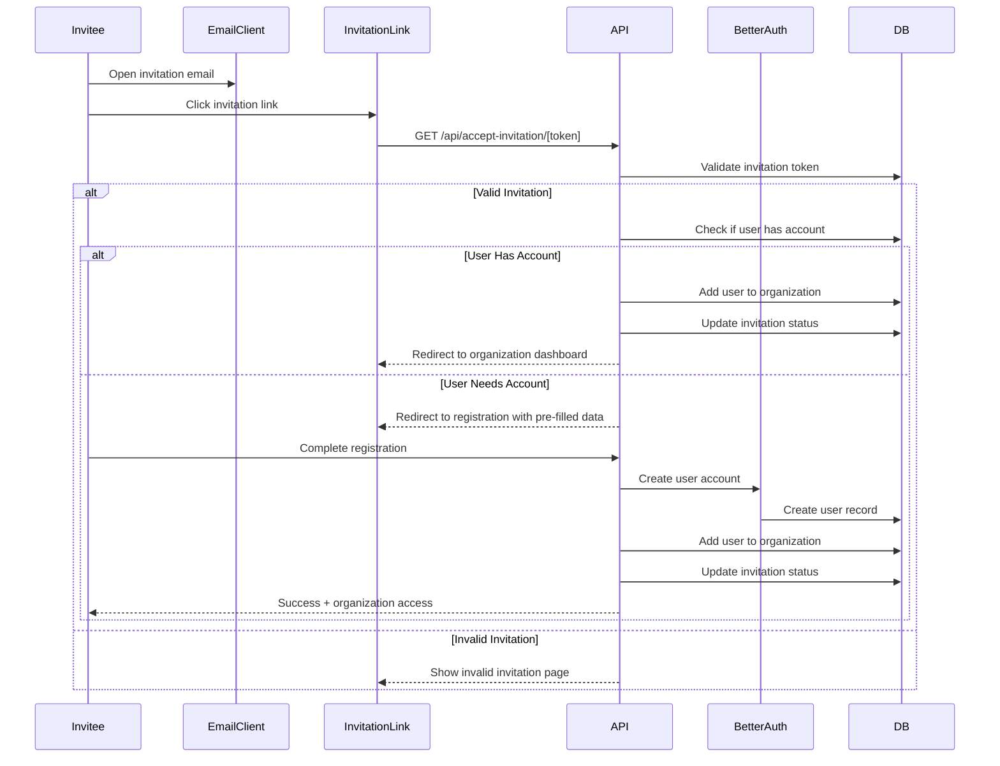

## 7. Theme and Preferences Flow

### Theme Switching Flow

```mermaid
sequenceDiagram
    participant User
    participant ThemeSwitcher
    participant PreferenceStore
    participant LocalStorage
    participant CSSVariables

    User->>ThemeSwitcher: Click theme toggle
    ThemeSwitcher->>PreferenceStore: Toggle theme (light/dark)
    PreferenceStore->>LocalStorage: Save theme preference
    PreferenceStore->>CSSVariables: Update CSS variables
    CSSVariables--->User: Immediate visual theme change
    PreferenceStore->>PreferenceStore: Sync with server (debounced)

    Note over User,PreferenceStore: Theme Preset Selection
    User->>ThemeSwitcher: Open theme preset menu
    ThemeSwitcher--->User: Show available presets (default, brutalist, soft-pop, tangerine)
    User->>ThemeSwitcher: Select theme preset
    ThemeSwitcher->>PreferenceStore: Apply preset
    PreferenceStore->>LocalStorage: Save preset preference
    PreferenceStore->>CSSVariables: Apply preset styles
    CSSVariables--->User: Visual preset applied
```

### Language Switching Flow

```mermaid
sequenceDiagram
    participant User
    participant LocaleSwitcher
    participant Router
    participant API
    participant TranslationService

    User->>LocaleSwitcher: Click language switcher
    LocaleSwitcher--->User: Show available languages
    User->>LocaleSwitcher: Select language (en/id)
    LocaleSwitcher->>Router: Navigate to /{locale}/current-path
    Router->>API: Request page with new locale
    API->>TranslationService: Load translations for locale
    TranslationService--->API: Translation data
    API--->Router: Rendered page with translations
    Router--->User: Page content in selected language
    LocaleSwitcher->>LocalStorage: Save language preference
```

## 8. Error Handling and User Feedback

### Application Error States

```mermaid
graph TD
    A[User Action] --> B{Success?}
    B -->|Yes| C[Show Success Feedback]
    B -->|No| D[Show Error Message]

    C --> E[Update UI State]
    C --> F[Log Analytics Event]

    D --> G{Error Type}
    G -->|Validation Error| H[Show Field Errors]
    G -->|Network Error| I[Show Retry Option]
    G -->|Permission Error| J[Redirect or Show Access Denied]
    G -->|Server Error| K[Show Generic Error Message]

    H --> L[Highlight Invalid Fields]
    I --> M[Retry Action on Request]
    J --> N[Contact Admin Option]
    K --> O[Try Again Later Message]
```

### Loading States and Feedback

```typescript
interface LoadingStates {
  initial: "Initial loading state";
  loading: "Action in progress";
  success: "Action completed successfully";
  error: "Action failed";
  validating: "Form validation in progress";
  uploading: "File upload in progress";
  saving: "Saving changes";
  deleting: "Deleting item";
  refreshing: "Refreshing data";
}
```

### User Feedback Patterns

```typescript
interface FeedbackPatterns {
  success: {
    toast: "Brief success notification";
    banner: "Persistent success message";
    inline: "Success state within form";
    modal: "Success confirmation dialog";
  };
  error: {
    field: "Field-specific error message";
    form: "Form-level error summary";
    toast: "Brief error notification";
    page: "Full-page error state";
  };
  progress: {
    spinner: "Loading spinner";
    skeleton: "Content skeleton loader";
    progress: "Progress bar";
    steps: "Multi-step progress indicator";
  };
}
```

---

**Document Version**: 1.1
**Last Updated**: December 8, 2024
**Next Review**: January 31, 2025
