# Authentication User Flows

## Overview

This document outlines the complete authentication flows within the application, including user registration, login, logout, password reset, and social authentication processes.

## Authentication Flow Summary

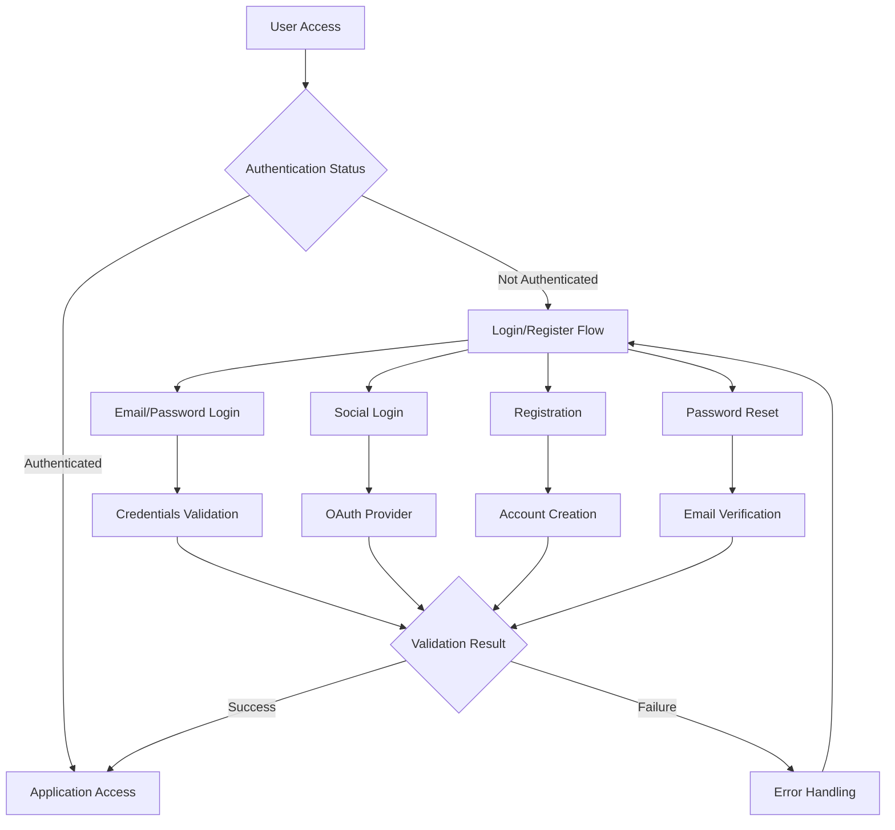

## 1. User Registration Flow

### Registration Process

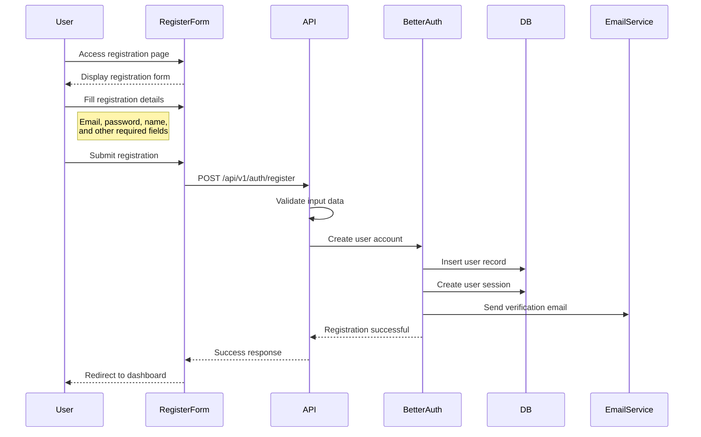

### Registration Validation Flow

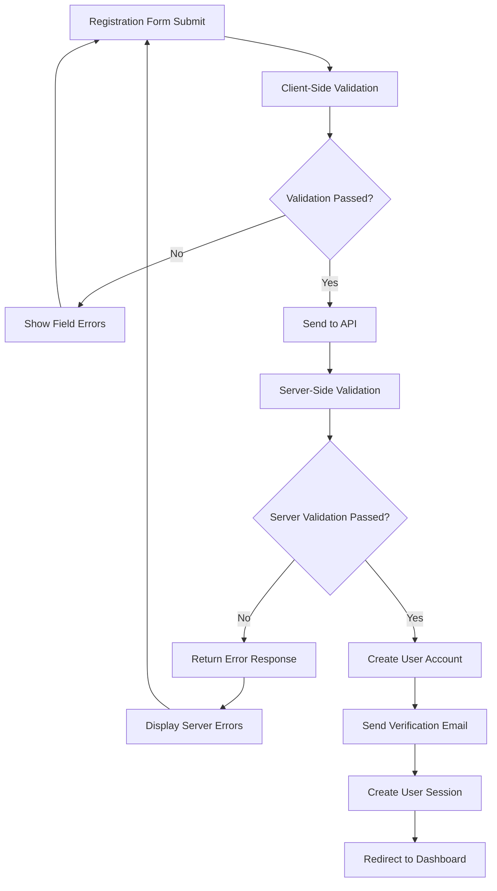

### Registration Form Fields

```typescript
interface RegistrationForm {
  name: string; // Required, min 2 chars
  email: string; // Required, valid email
  password: string; // Required, 8-128 chars
  confirmPassword: string; // Must match password
  organizationName?: string; // Optional, creates org if provided
  acceptTerms: boolean; // Required, must be true
}
```

### Validation Rules

- **Name**: 2-100 characters, alphanumeric + spaces
- **Email**: Valid email format, unique in database
- **Password**: 8-128 characters, complexity requirements
- **Organization Name**: Optional, 2-100 characters if provided
- **Terms**: Must be accepted

### Error Handling

```typescript
interface RegistrationErrors {
  name?: string; // Invalid name format
  email?: string; // Email already exists or invalid
  password?: string; // Password too weak
  confirmPassword?: string; // Passwords don't match
  organizationName?: string; // Invalid organization name
  acceptTerms?: string; // Terms must be accepted
  server?: string; // Server-side errors
}
```

## 2. User Login Flow

### Flow Diagram

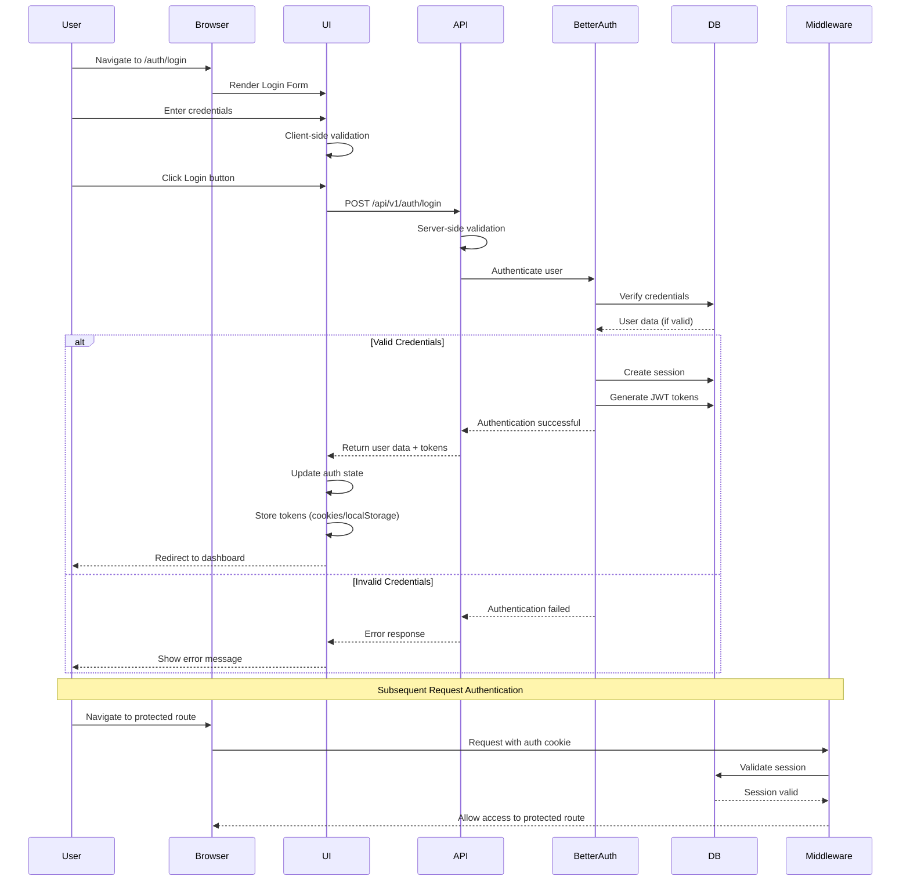

### Login Form Fields

```typescript
interface LoginForm {
  email: string; // Required, valid email
  password: string; // Required
  rememberMe?: boolean; // Optional, extends session
}
```

### Session Management

- **Session Duration**: 3 days (configurable)
- **Session Refresh**: Automatic refresh if used within 1 day
- **Token Storage**: Secure HTTP-only cookies + localStorage for API calls
- **Session Invalidation**: Manual logout or automatic expiration

### Login States

```typescript
interface LoginState {
  isLoading: boolean; // Form submission in progress
  error?: string; // Login error message
  success: boolean; // Login successful
  requiresEmailVerification: boolean; // Email not verified
  isBanned: boolean; // Account banned
  banReason?: string; // Reason for ban
  banExpires?: Date; // Ban expiration date
}
```

## 3. Social Authentication Flow (Google OAuth)

### Flow Diagram

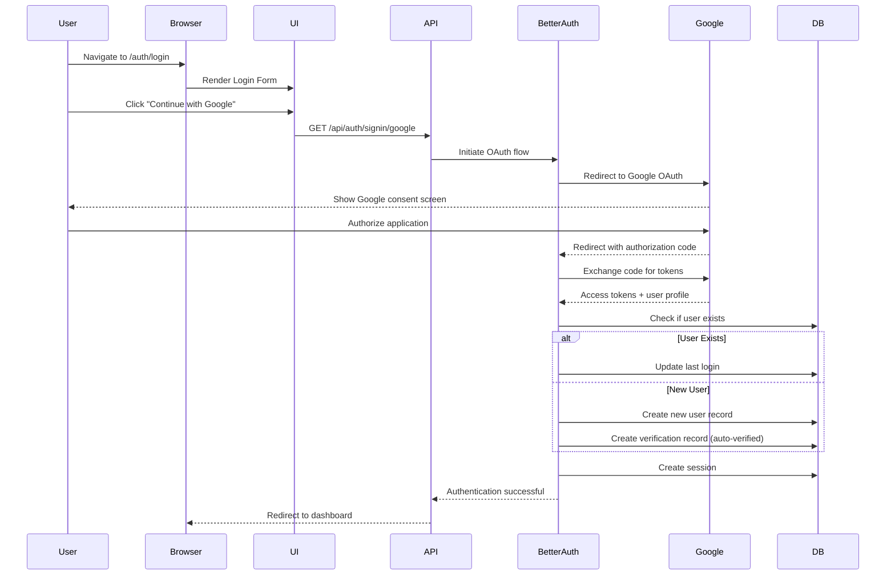

### Google OAuth Configuration

```typescript
interface GoogleOAuthConfig {
  clientId: string; // Google OAuth client ID
  clientSecret: string; // Google OAuth client secret
  redirectUri: string; // Authorized redirect URI
  scope: string[]; // Requested permissions
}
```

### Profile Mapping

```typescript
interface ProfileMapping {
  email: string; // From Google profile
  name: string; // From Google profile
  image?: string; // From Google profile
  emailVerified: true; // Auto-verified for OAuth
  role: "USER"; // Default role for OAuth users
}
```

## 4. Email Verification Flow

### Flow Diagram

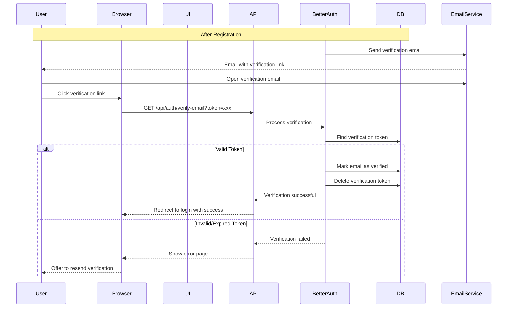

### Verification Email Template

```typescript
interface VerificationEmail {
  to: string; // User's email address
  subject: string; // "Verify your email address"
  verificationUrl: string; // Unique verification link
  expirationHours: number; // Token expiration (24 hours)
  userName: string; // User's name for personalization
}
```

### Resend Verification Flow

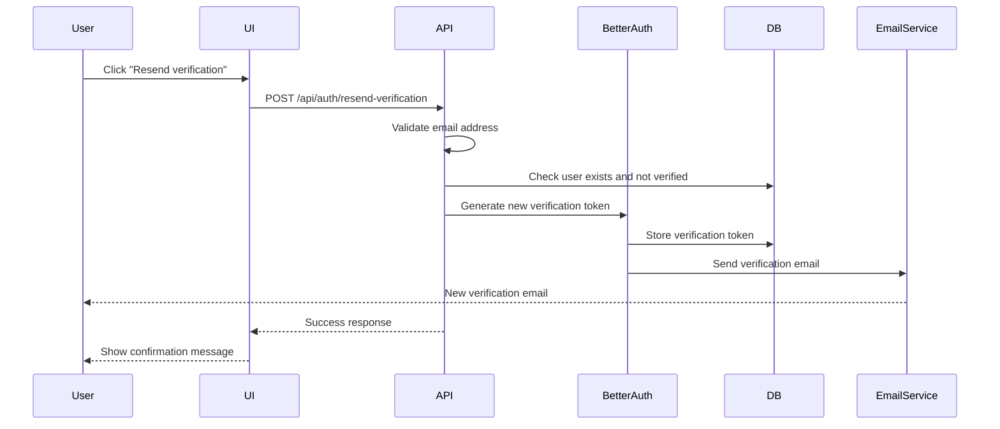

## 5. Password Reset Flow

### Flow Diagram

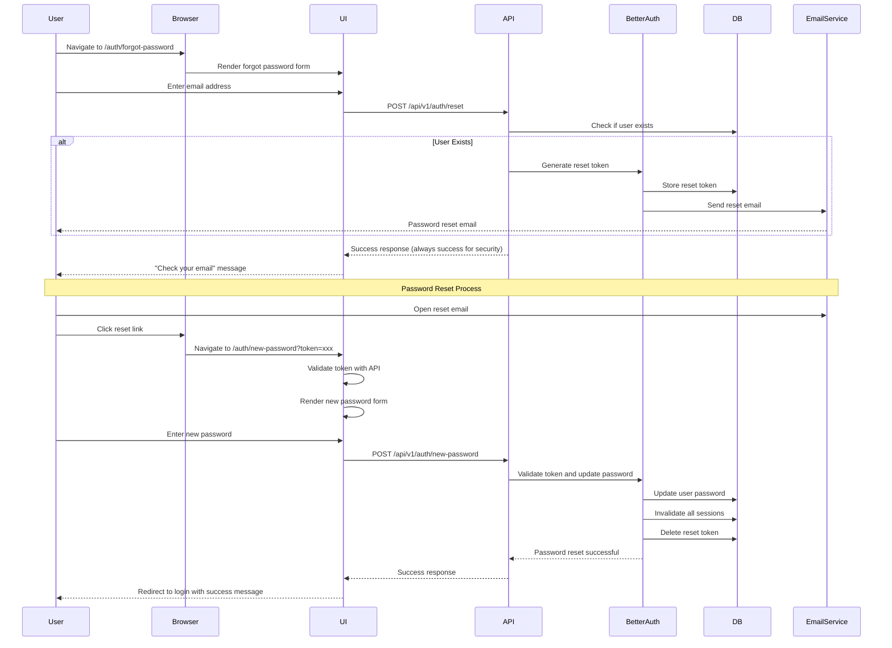

### Password Reset Form Fields

```typescript
interface PasswordResetForm {
  password: string; // Required, 8-128 chars
  confirmPassword: string; // Must match password
}
```

### Reset Token Properties

- **Expiration**: 24 hours
- **Single Use**: Token becomes invalid after use
- **Security**: Cryptographically secure random tokens
- **Invalidation**: All sessions invalidated after password change

## 6. User Logout Flow

### Flow Diagram

```mermaid
sequenceDiagram
    participant User
    participant Browser
    participant UI
    participant API
    participant BetterAuth
    participant DB

    User->>UI: Click logout button
    UI->>API: POST /api/v1/auth/logout
    API->>BetterAuth: Logout request
    BetterAuth->>DB: Delete session
    BetterAuth->>DB: Revoke JWT tokens
    BetterAuth-->>API: Logout successful
    API-->>UI: Success response
    UI->>UI: Clear local auth state
    UI->>UI: Clear tokens from storage
    UI--->User: Redirect to login page
```

### Logout Options

```typescript
interface LogoutOptions {
  allDevices?: boolean; // Logout from all devices
  redirectUrl?: string; // Custom redirect after logout
}
```

## 7. Session Management Flow

### Session Validation

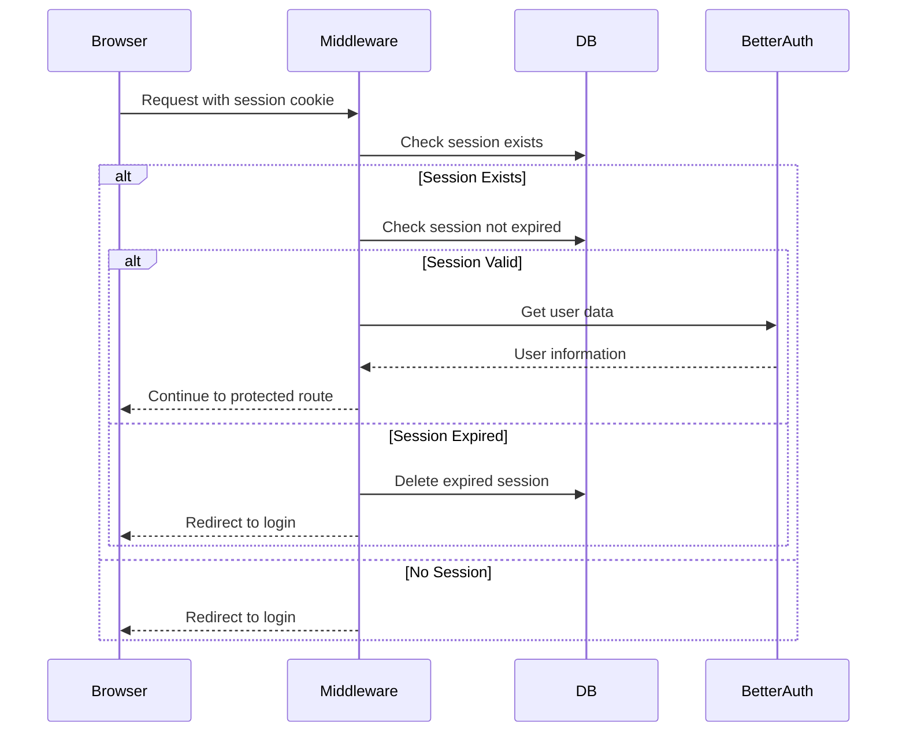

### Session Refresh Flow

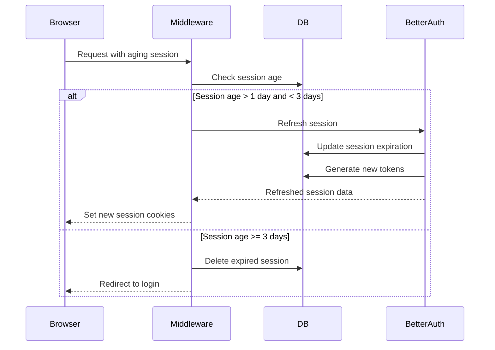

## 8. Multi-Factor Authentication (Future Enhancement)

### Planned MFA Flow

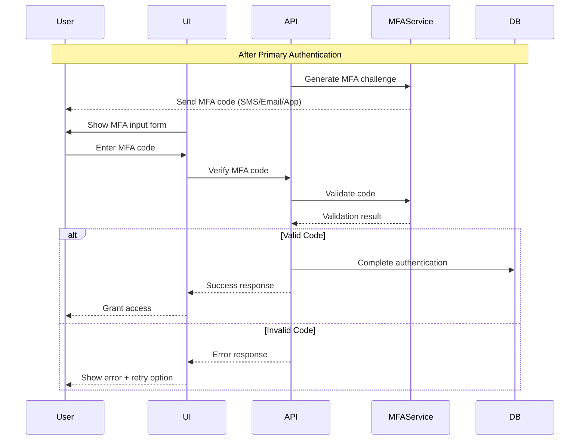

## 9. Error Handling and User Feedback

### Common Error Scenarios

```typescript
interface AuthErrorCodes {
  INVALID_CREDENTIALS: "Email or password is incorrect";
  USER_NOT_FOUND: "No account found with this email";
  EMAIL_NOT_VERIFIED: "Please verify your email before logging in";
  ACCOUNT_BANNED: "Your account has been banned";
  WEAK_PASSWORD: "Password does not meet security requirements";
  EMAIL_EXISTS: "An account with this email already exists";
  INVALID_TOKEN: "Invalid or expired verification link";
  RATE_LIMITED: "Too many attempts. Please try again later";
  OAUTH_ERROR: "Failed to authenticate with Google";
  NETWORK_ERROR: "Connection error. Please try again";
}
```

### User Feedback Patterns

```typescript
interface UserFeedback {
  success: {
    type: "success";
    message: string;
    action?: string; // Optional action button text
    actionUrl?: string; // Optional action URL
  };
  error: {
    type: "error";
    message: string;
    code?: string; // Error code for logging
    retryable?: boolean; // Can user retry the action
  };
  warning: {
    type: "warning";
    message: string;
    dismissible?: boolean; // Can user dismiss the warning
  };
  info: {
    type: "info";
    message: string;
    persistent?: boolean; // Stays visible until dismissed
  };
}
```

## 10. Security Considerations

### Authentication Security Measures

- **Password Requirements**: Minimum 8 characters, complexity rules
- **Rate Limiting**: Prevent brute force attacks
- **Session Security**: HTTP-only, secure cookies
- **CSRF Protection**: SameSite cookie attributes
- **Token Security**: JWT with RS256 signing
- **Account Lockout**: Temporary bans after failed attempts

### Data Protection

- **Email Privacy**: Email addresses only used for authentication
- **Password Security**: Never stored in plain text
- **Session Data**: Minimal data stored in sessions
- **Audit Logging**: All authentication events logged
- **Data Encryption**: All sensitive data encrypted at rest

---

**Document Version**: 1.0
**Last Updated**: October 31, 2025
**Next Review**: January 31, 2026
